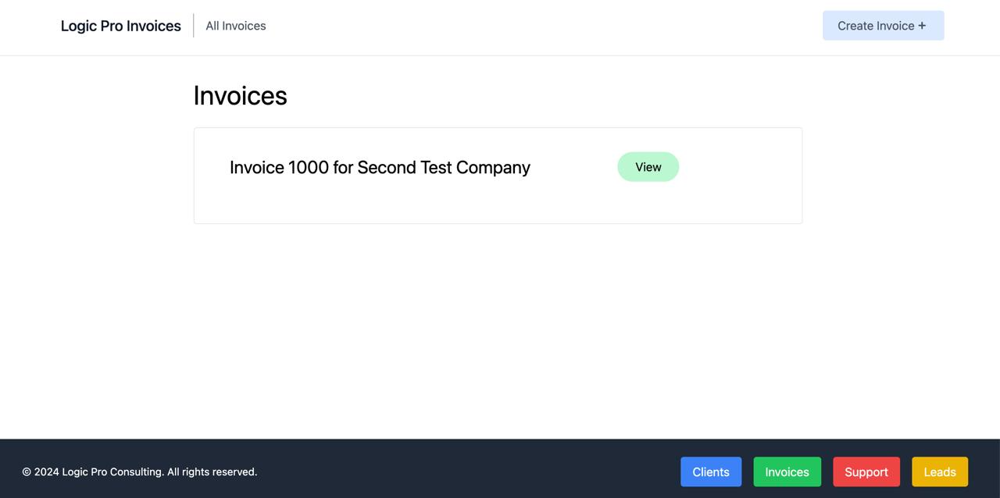

# Tech CRM
This is a web application built with Python and Django 
that gives a tech consultant a suite of tools to manage 
their business.
## Project Overview
Tech CRM is a web application that's designed to give a tech 
consultant an extensive suite of tools allowing them to 
manage their business through an internal website hosted on 
their office server. I started this project for a client in 
Oklahoma City who wanted to build a relational database 
that made their business operations much easier.

The following technologies were used in the development 
of this project:

* Visual Studio Code
* PyCharm
* Python
* Django
* PostgreSQL
* HTML
* CSS
## Development
This web application started as a need to solve a problem 
for a tech consultant in Oklahoma City. He wanted a set of 
tools that would be easy for him and his business partner 
to use in the operations of their business as they worked 
to grow their reach in the Oklahoma City market.

The primary desire for this company was to create a 
centralized server that allowed them to manage invoices 
and payments because of the amount of time it required 
them to accomplish this manually. So, every feature added 
to this application is in service of their goal to 
optimize their income and financial growth of the 
company.

This project is complete and operational in its current 
state.
## Solution Design
This project had a solid design that centered on two primary 
features:
1. Invoicing (to track accounts receivable)
2. Payments (to have a centralized location to record accounts receivables)

However, we added some additional functionality that 
contributed to growing their financial security as a small 
consulting firm:
* New Client Leads (to generate more income)
* Support Tickets (to automate billing)
## Upcoming Plans
There is an opportunity to take this internal web 
application and put it online to allow their customers to 
add their own support tickets, view and pay invoices, and 
monitor their servers and other technologies managed by 
the consultants.
## Current Design
